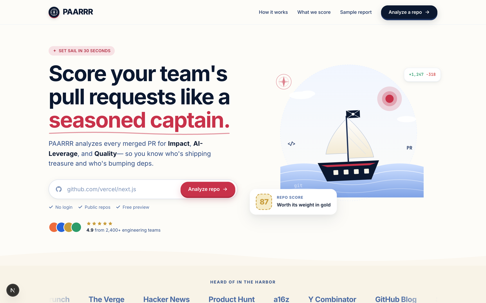
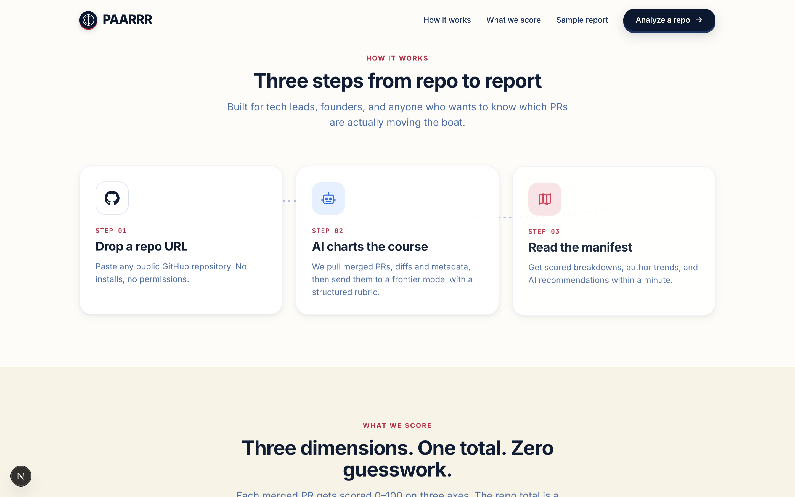
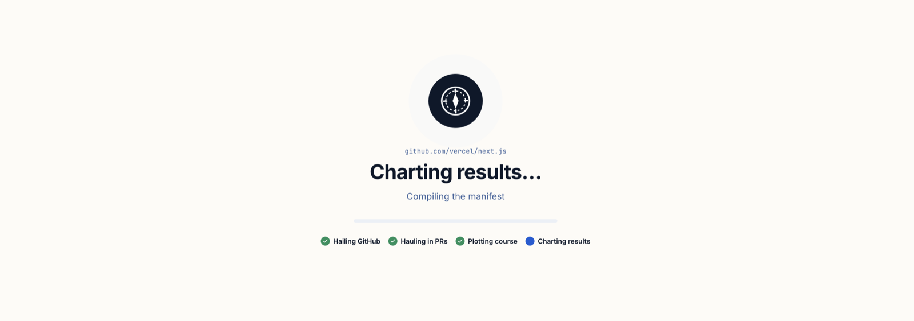
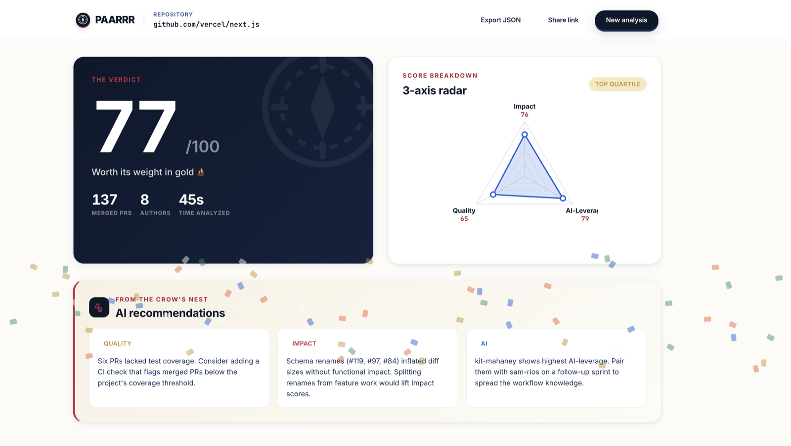

# PAARRR

**Pull-request Automated Analysis, Reporting, & Review Rig**

Point PAARRR at a public GitHub repo, get an AI-generated quality score across three dimensions: **Impact**, **AI-Leverage**, and **Quality** — for each merged pull request and for the repo as a whole.

> Recruitment task for PhotoAID. Live demo + recording links land in this README before submission.

<p align="center">
  
</p>

<p align="center">
  
  
  
</p>

---

## Run locally

```bash
pnpm install
cp .env.example .env.local   # add OPENAI_API_KEY (and optional GITHUB_TOKEN)
pnpm dev
```

App is at <http://localhost:3000>.

Other scripts: `pnpm build`, `pnpm start`, `pnpm check` (typecheck + lint + format check), `pnpm lint:fix`, `pnpm format`.

## Stack

- **Next.js 16 (App Router) + React 19 + TypeScript** — single deployable on Vercel; route handlers cover the "mini backend" so there is no extra service to host. Static prerendering of the LP keeps Lighthouse mobile in the 90s with zero work.
- **Tailwind v4 + shadcn/ui (base-nova preset, neutral)** — a fast, accessible primitives layer, restyled to match the [passport-photo.online](https://passport-photo.online) look. Tailwind v4's `@theme` block keeps tokens in CSS, not JS.
- **Framer Motion + Recharts** — animation polish on the LP, charts on the dashboard.
- **OpenAI SDK + Octokit** — scoring (structured outputs / JSON schema) and GitHub data fetching.
- **oxlint + oxfmt (oxc)** — Rust-based linter + formatter. Roughly an order of magnitude faster than ESLint/Prettier and zero-config for this scale of project.

## Scoring weights

`total = 0.40 × Impact + 0.35 × AI-Leverage + 0.25 × Quality`

Reasoning:

- **Impact (40%)** — the brief frames Impact as "real value vs. churn"; that is the dimension a hiring manager actually wants ranked first when looking at a repo's PR stream.
- **AI-Leverage (35%)** — PhotoAID is explicitly hiring for AI leverage ("90% kodu generujemy z AI"). Weighting it high makes the scorer surface candidates whose PRs read as AI-authored.
- **Quality (25%)** — non-negotiable hygiene, but in an AI-first workflow it is partially absorbed by AI-Leverage (well-prompted AI tends to ship focused, single-purpose PRs with tests). Weighted lowest to avoid double-counting.

Weights live in `src/lib/scoring/weights.ts` — single source of truth, tweakable.

## How AI was used

- **Driver:** Claude Code (Opus) with an iterative loop (plan → tool calls → review diff → adjust).
- **What AI did:** scaffold (Next.js + shadcn + oxc), the scoring prompt design, type schemas, the LP component code, dashboard charts, and most of the README copy.
- **What I did myself:** scoring weight calibration (judgement call about the brief's intent), the choice to swap ESLint for oxc, edge-case prioritization (rate limit, no-PR repo), and visual direction.
- **Traces:** `prompts.md` captures the most useful prompts. Co-authored-by trailers and `[ai]`/`[cc]` tags appear in commit history where relevant.

## Design decisions

The brief leaves several details open. Where I chose:

- **PR sample size** — latest 5 merged PRs, ranked into the dashboard. Reason: recent work is the strongest signal of how someone codes today, and a tight sample keeps OpenAI spend and round-trip latency low.
- **GitHub auth** — anonymous by default (60 req/h). If `GITHUB_TOKEN` is in env, it is used (5000 req/h). When the public limit is hit we degrade gracefully with an inline message and a token field.
- **LLM model** — `gpt-5-mini` for individual PR scoring (cheap, fast, accurate at this constrained task), `gpt-5` for the repo-level recommendations (3 sentences, higher leverage). Both via structured outputs.
- **Caching** — repo analysis hashed by `(owner, repo, latest-merge-sha)` and cached in memory for the lifetime of the server process. Good enough for a demo; Redis is the obvious next step.
- **Recruitment brief** — `zadanie_rekrutacyjne_photoaid.md` is gitignored. It is a hiring document, not project content.

## What I would do next

- Persist analyses in Postgres (currently in-memory) — enables shareable `/results/[hash]` URLs, history, leaderboards.
- Stream the scoring step from the server with a `useEffect` + Server-Sent Events for true realtime progress instead of a single blocking wait.
- Per-author drilldown view (radar chart of their median scores, PR count, trend line over the last N PRs).
- PNG / SVG badge export for PRs and repos so candidates can drop them into their own READMEs.
- Add Anthropic Claude as an alternative provider behind a feature flag — the brief is from a Claude shop, even if my key was OpenAI.

## Links

- Live demo: _added before submission_
- Screen recording (30+ min, voice + webcam PiP): _added before submission_
- Repo: _this one_
